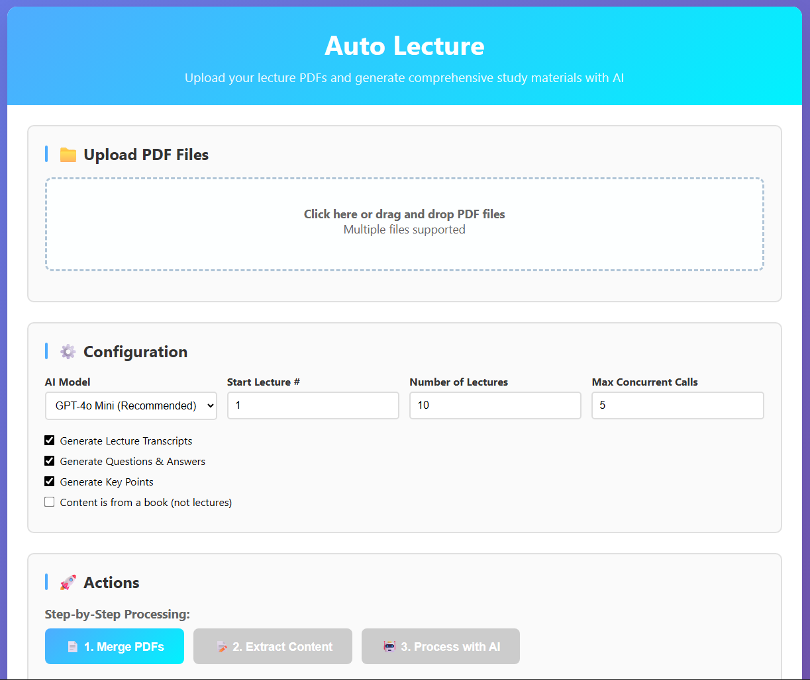
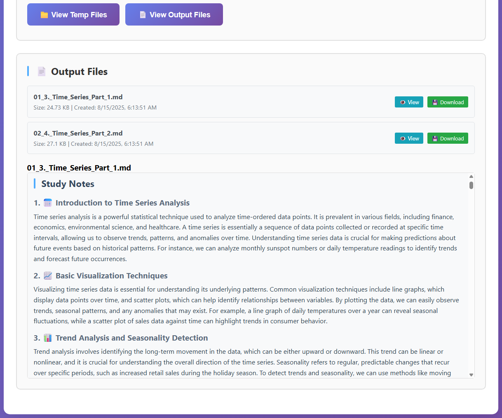

# Auto Lecture

An system for intelligently processing lecture PDFs and generating comprehensive study materials using AI.

## Overview
This project transforms lecture PDFs into structured study materials, including detailed study notes, lecture transcripts, multiple choice questions with answers, and key points.




## Project Structure

```
auto-lecture-app/
├── backend/                   # FastAPI REST API
│   ├── app/
│   │   ├── config.py         # Configuration and prompts
│   │   ├── models.py         # Pydantic data models
│   │   ├── routers/          # API endpoints
│   │   └── services/         # Core business logic
│   ├── main.py               # FastAPI application
│   ├── requirements.txt      # Python dependencies
│   ├── example_usage.py      # Usage examples
│   └── README.md             # Backend documentation
├── frontend/                 # HTML/CSS/JS Frontend
│   ├── index.html           # Single-page web application
│   ├── serve.py             # Development server
│   ├── start.bat/.sh        # Startup scripts
│   └── README.md            # Frontend documentation
└── scripts/                  # Original Python scripts
    ├── 1_merge_slides.py     # PDF merging
    ├── 2_extract_content.py  # Content extraction
    ├── 3_call_api.py         # AI processing
    ├── config.py             # Shared configuration
    └── flags.py              # Feature flags
```

## Quick Start

### 1. Backend Setup

```bash
cd backend

# Install dependencies
pip install -r requirements.txt

# Set up environment
cp .env.example .env
# Edit .env and add your OpenAI API key

# Start the server
python main.py
```

The API will be available at:

- **Main API**: http://localhost:8000
- **Documentation**: http://localhost:8000/docs
- **Health Check**: http://localhost:8000/health

### 2. Frontend Setup (Web Interface)

```bash
cd frontend

# Start the frontend server
python serve.py

# Or use startup scripts:
# Windows: start.bat
# Linux/Mac: ./start.sh
```

The frontend will be available at:

- **Web Interface**: http://localhost:3000

### 3. Using the Application

#### Option A: Web Interface (Recommended)

1. Open http://localhost:3000 in your browser
2. Drag and drop PDF files or click to upload
3. Configure processing settings (AI model, options, etc.)
4. Click "Process Complete Pipeline"
5. View and download results

#### Option B: API Directly

Upload multiple PDFs and get fully processed study materials in one call:

```bash
curl -X POST "http://localhost:8000/api/v1/process-complete-pipeline" \
  -F "files=@lecture1.pdf" \
  -F "files=@lecture2.pdf" \
  -F "max_concurrent=3"
```

#### Option C: Step-by-Step Processing

```bash
curl -X POST "http://localhost:8000/api/v1/process-complete-pipeline" \
  -F "files=@lecture1.pdf" \
  -F "files=@lecture2.pdf" \
  -F "max_concurrent=3"
```

1. **Merge PDFs**:

   ```bash
   curl -X POST "http://localhost:8000/api/v1/merge-pdfs" \
     -F "files=@lecture1.pdf" \
     -F "files=@lecture2.pdf"
   ```

2. **Extract Content**:

   ```bash
   curl -X POST "http://localhost:8000/api/v1/extract-content" \
     -F "file=@merged.pdf"
   ```

3. **Generate Study Materials**:
   ```bash
   curl -X POST "http://localhost:8000/api/v1/process-lectures" \
     -F "lectures_json=$(cat lectures.json)"
   ```

### 3. Configuration

Customize processing settings:

```bash
curl -X POST "http://localhost:8000/api/v1/update-config" \
  -H "Content-Type: application/json" \
  -d '{
    "MODEL": "gpt-4o-mini",
    "GET_TRANSCRIPTS": true,
    "GET_Q_AND_A": true,
    "GET_KEY_POINTS": true,
    "NUM_LECS": 10
  }'
```

## Features

### PDF Processing

- **Merge Multiple PDFs**: Combine lecture slides into a single document
- **Smart Bookmarking**: Automatically create navigation bookmarks
- **Content Extraction**: Extract text content organized by lecture sections

### AI-Powered Generation

- **Study Notes**: Comprehensive, well-structured notes with detailed explanations
- **Transcripts**: Natural language lecture transcripts
- **Questions & Answers**: Multiple choice questions with detailed explanations
- **Key Points**: Essential facts and concepts for quick review

### Configurable Processing

- **Model Selection**: Choose from various OpenAI models (GPT-4o, GPT-4o-mini, etc.)
- **Selective Generation**: Toggle transcripts, Q&A, and key points independently
- **Batch Processing**: Process multiple lectures with concurrency control
- **Cost Tracking**: Monitor API usage and costs

### Modern API

- **REST API**: Clean, documented FastAPI endpoints
- **Interactive Docs**: Built-in Swagger UI for testing
- **File Upload**: Support for multiple PDF file uploads
- **Error Handling**: Comprehensive error responses and logging

## Original Scripts

The `scripts/` directory contains the original Python scripts that were converted into the FastAPI backend:

- **`1_merge_slides.py`**: Merges PDF files from a `slides/` folder
- **`2_extract_content.py`**: Extracts content and creates `Lectures.json`
- **`3_call_api.py`**: Processes lectures with OpenAI API
- **`config.py`**: Contains prompts and utility functions
- **`flags.py`**: Feature configuration flags

These scripts can still be used standalone if preferred.

## Examples

### Python Usage

```python
import requests

# Complete pipeline
files = [
    ('files', ('lecture1.pdf', open('lecture1.pdf', 'rb'))),
    ('files', ('lecture2.pdf', open('lecture2.pdf', 'rb')))
]

response = requests.post(
    'http://localhost:8000/api/v1/process-complete-pipeline',
    files=files,
    data={'max_concurrent': 2}
)

result = response.json()
print(f"Processed {result['processed_count']} lectures")
print(f"Total cost: ${result['total_cost']:.4f}")
```

See `backend/example_usage.py` for a complete example.

## Requirements

- **Python 3.8+**
- **OpenAI API Key**
- **PDF files with table of contents** (for proper content extraction)

## Cost Estimation

Typical costs per lecture (using gpt-4o-mini):

- Study notes: ~$0.002-0.008
- Questions & answers: ~$0.004-0.012
- Key points: ~$0.001-0.003
- Transcripts: ~$0.003-0.010

**Total per lecture**: ~$0.01-0.03

## Contributing

1. Fork the repository
2. Create a feature branch
3. Make your changes
4. Add tests if applicable
5. Submit a pull request

## License

[Add your license here]

## Support

For issues and questions:

1. Check the [API documentation](http://localhost:8000/docs)
2. Review the [backend README](backend/README.md)
3. Run the example script: `python backend/example_usage.py`
4. Create an issue with detailed error logs
